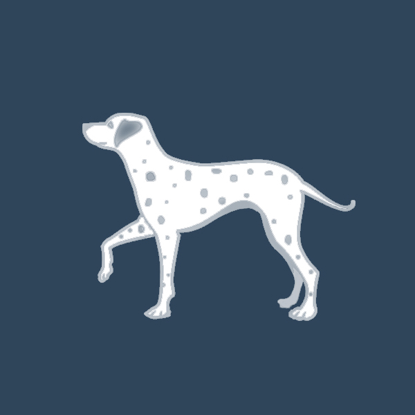

# Spot

This is a 46-hour team project for Esri Second Annual Weekend of Innovation. 

## Teamwork 
| Work | Anup Deulgaonkar | Jake Devost | Keyur Kulkarni | Yankuan Zhang |
| :----: | :-----: | :-----: | :-----: | :-----: | :-----: |
| Demo |✅| | |✅|
| C/S Communication |✅| | ||
| Unity3D |✅| | |✅|
| Coordinate Algorithm |✅| | |✅|
| UI/UX ideation, Graphic Communication | |✅| | |
| Logo & Icon | |✅| |✅|
| Presentation | |✅|✅| |
| Feature service implementation | | |✅| |
| GeoData | | |✅| |

##Demo
- A demo video can be found [here](https://youtu.be/jD6eDb-i6jM).
- A presentation can be found [here](https://youtu.be/M4NN-aa8t5E).

## C/S Communication
REST API of ArcGIS Server 

## Unity3D
We used [Vuforia](https://developer.vuforia.com/) package for Unity3D.

## Coordinate Algorithm 
To be documented...

## UI/UX...
Jake's fantastic works

## Logo & Icon
### Splash Screen

### App Icon 
There will be a version with better quality to be released...

## Presentation 
Presented by Jake and Keyur. Click [here](Spot_presentation_slides.pdf) for slides.

## Future work
- Refine UI
	- better-quality icon
	- properly organized labels
	- sync label position vertically

- Migrate out of Unity3D
	- use Vuforia iOS [SDK](https://developer.vuforia.com/downloads/sdk)
	- try [Wikitude](http://www.wikitude.com/)

- Enable accessibility
	- Voice control
	- Speak-out
