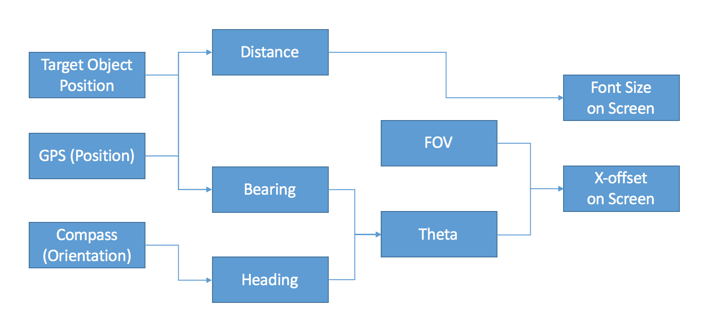
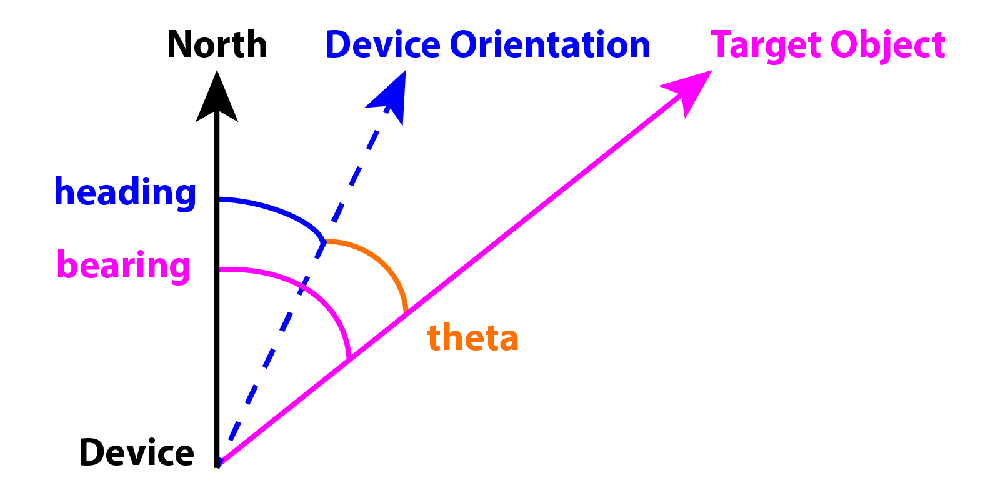
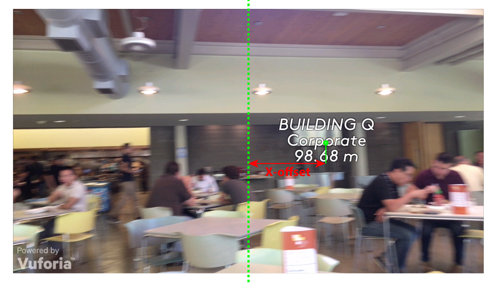

# Spot

This is a 46-hour team project for Esri Second Annual Weekend of Innovation. 

## Teamwork 

| Work | Anup Deulgaonkar | Jake Devost | Keyur Kulkarni | Yankuan Zhang |
| :----: | :-----: | :-----: | :-----: | :-----: | :-----: |
| [Demo and Presentation](#demo-and-presentation) | ✅ | ✅ | ✅ | ✅ |
| [Data Communication](#data-communication) | ✅ | | ✅ | |
| [Unity3D](#unity3d) | ✅ | |  | ✅ |
| [Coordinate Algorithm](#coordinate-algorithm) | ✅ | | | ✅ |
| [UI/UX Design](#uiux-design) | | ✅ | | ✅ |

And [future work](#future-work).

## Demo and Presentation

- [Demo video](https://youtu.be/jD6eDb-i6jM)
- [Presentation](https://youtu.be/M4NN-aa8t5E) 
- [Slides](Spot_presentation_slides.pdf)

## Data Communication

REST API of [ArcGIS Server](https://services6.arcgis.com/j576TQTjtSTh0SdN/ArcGIS/rest/services/HackESRI/FeatureServer/0).

### Callback JSON data structure

For each element in the array of `features` in callback, we have object **name** and its **description** as well as **latitude and longitude** for the center point of the object, e.g.,
	
	{
		"attributes" : {
			"Building" : "Building Q", 
			"Descriptio" : "Corporate"
		}, 
		"geometry" : 
		{
			"x" : -117.19569250299996, 
			"y" : 34.056070361000017
		}
	},

## Unity3D

We used [Vuforia](https://developer.vuforia.com/) package for [Unity3D](https://unity3d.com/). Repo subfolder [Spot](Spot) is the Unity3D project.

### Installation guidelines 

To be documented...

## App Design and Implementation 

### Architecture

### Algorithms

Don't forget to check angle unit (deg or rad) when use trigonometric functions. Here, input `lat1`, `lon1`, `lat2`, `lon2` are all in degree. If trigonometric functions are in radian, we will convert coordinates to radian by multiplying by `DEG_TO_RAD`, value of which is `pi/180`. If we want to convert from rad to deg, then multiply by `RAD_TO_DEG`, value of which is `180/pi`.

#### Distance 

	function distanceBetween(lat1, lon1, lat2, lon2) {
		lat1 = lat1 * DEG_TO_RAD;
		lon1 = lon1 * DEG_TO_RAD;
		lat2 = lat2 * DEG_TO_RAD;
		lon2 = lon2 * DEG_TO_RAD;

	    dLat = lat2 - lat1;
	    dLon = lon2 - lon1;
	    a = sin(dLat / 2) * sin(dLat / 2) + cos(lat1) * cos(lat1) * sin(dLon / 2) * sin(dLon / 2);
	    return EARTH_RADIUS * 2 * atan2(sqrt(a), sqrt(1 - a)); // EARTH_RADIUS ~ 6371 km
	}

#### Font Size

Label font size ranges from 19 to 40. If the distance is greater than 300m, fix the size to 19.

	distance = distanceBetween(...);
	
	function getFontSizeFromDistance(distance) {
		// unit of distance: meter
		if (distance > 300) {
			return 19;
		} 
		return ceil(40 - distance / 14);
	} 

#### Bearing 

The return value ∈ `(-180, 180]`.

	function bearingBetween(lat1, lon1, lat2, lon2) {
		lat1 = lat1 * DEG_TO_RAD;
		lon1 = lon1 * DEG_TO_RAD;
		lat2 = lat2 * DEG_TO_RAD;
		lon2 = lon2 * DEG_TO_RAD;

	    y = sin(lon2 - lon1) * cos(lat2);
	    x = cos(lat1) * sin(lat2) - sin(lat1) * cos(lat2) * cos(lon2 - lon1);
	    return atan2(y, x) * RAD_TO_DEG;
	}
	
#### Theta

Because 

- `bearing` ∈ `(-180, 180]`
- `heading` ∈ `[0, 360)` (read from device sensor)

So, `bearing - heading` ∈ `(-540, 180]`. To deduce the range to `(-180, 180]`,
	
	bearing = bearingBetween(...);
	heading = compass.trueHeading;
	
	function calculateTheta(bearing, heading) {
		theta = bearing - heading;
		return (theta < -180) ? theta + 360 : theta;
	}
	
#### FOV 

FOV (field of view) is a camera parameter. For iPhone 6 camera, FOV is 63.54°, according to [this](http://www.wired.com/2015/05/measuring-field-view-iphone-6-camera/). And this number works as well for iPhone 5S/SE.

(Yes, we should read the parameter from device sensor API directly. But the numbers we read did not really make sense to us and would lead to wrong label position calculation. So we hardcoded it for now until we figure it out.)

#### X-offset on screen

To calculate label `xOffset` from vertical center line of the screen, we need:

- FOV
- `theta`
- width of screen (read from device)

Let's skip the how we get the formula and give it directly: 

	function getXOffset(theta, fieldOfView, screenWidth) {
		theta = theta * DEG_TO_RAD;
		fieldOfView = fieldOfView * DEG_TO_RAD;

		return 0.5 * tan(theta) / tan(fieldOfView) * screenWidth;
	}
	
Yes, we can do the same calculation for `yOffset`, with:

- vertical FOV
- vertical `theta`
- height of screen

## UI/UX Design

### UI/UX ideation and Graphic Communication

By Jake. See more Jake's fantastic works, click [here](https://issuu.com/robertdevost/).

### Splash Screen

### App Icon 

There will be a version with better quality to be released...

## Future Work

- Refine UI
	- perspective
		- contrast in color 	 
	- better-quality icon
	- label
		- tappable
		- properly organized labels
		- sync label position vertically
		- 3D

- Face-up
	- explore mode
		- interactive map
		- realtime-location
		- routing visualization 
	- detail mode
		- display more info for selected object

- Migrate out of Unity3D
	- use Vuforia iOS [SDK](https://developer.vuforia.com/downloads/sdk)
	- try [Wikitude](http://www.wikitude.com/)

- Enable accessibility
	- Voice control
	- Speak-out
